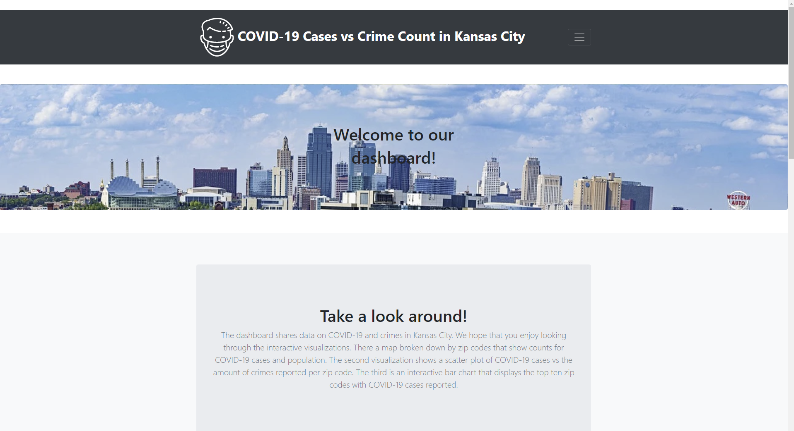
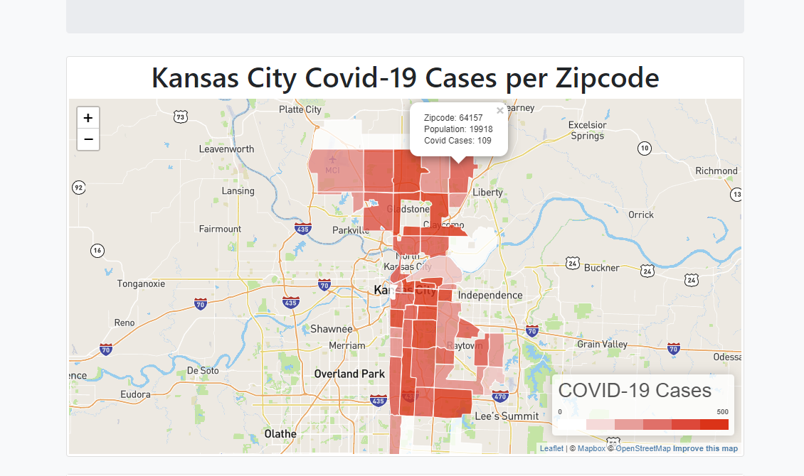
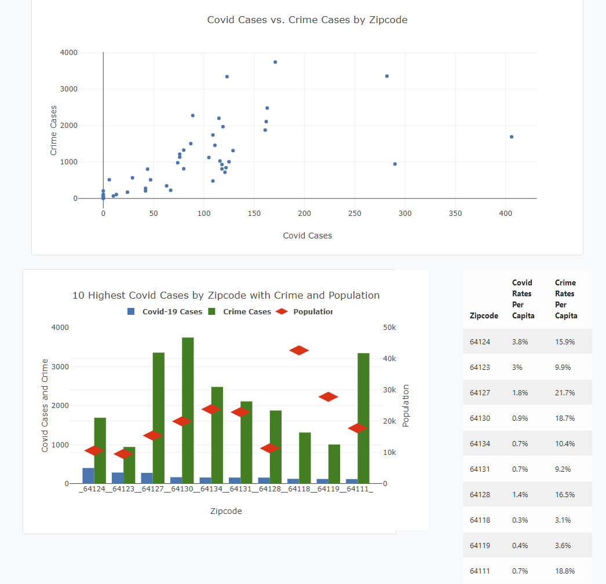

# COVID-19 | Crime | Populations A look at KCMO Zip Codes
#### Project Creaters: Carlee Young, Dylan Obermueller, Jerod Rhodes, and Trevor Guleserian

## Overview:
#### The Mahomies decided to collect data for Kansas City, MO on its COVID-19 cases, crime cases and population per zip code. Using SQLAlchemy, we sourced all of our data and created a SQL dataframe that we could leverage when creating our visualizations. Utilizing Flask 1.0 we created a webpage to house our visual representations of our findings. Performing and API call to our SQLAlchemy database, we read in the data needed to build our scatter and bar charts. 

#### To build the map,  chloropleth.js documentation and geoJSON data of the KCMO zip codes with population and covid cases added (expertly by Dylan and Trevor).  We utilized D3 to add a legend and tooltip for functionality.

## What does the data show us?
#### 1. What is the relationship or correlation between Covid-19 cases and number of crime cases per zip code?
#### 2. What is the relationship or correlation between Covid-19 cases and population per zip code?
#### 3. Is there other data that is contributing to Covid-19 cases and the number of crime cases per zip code?

## Theme:
#### Our goal was to tell a story about KCMO using our visualizations and allowing end users the ability to explore the data and relationships for themselves. We hoped by showing Covid-19, crime, and population together that we might be able to deduce any pattern for the area.

##Coding approach:
####

## Data wrangling techniques:
####

## Final layout:

